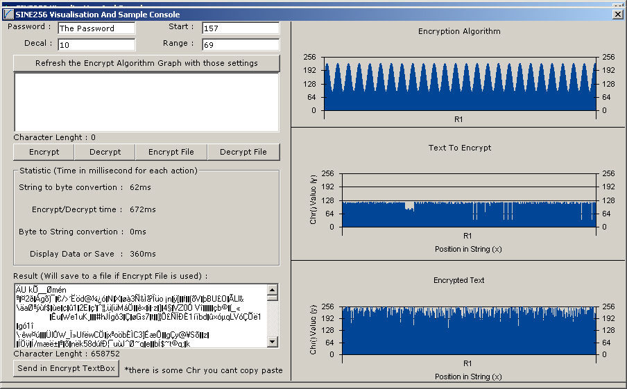



## A SINE256 Encryption Module \(Faster than winzip\)

### Description

Was tired of slow or inaccurate encryption i found on pscode so i made my own. I personnaly never saw anyone use this method and i personnaly never found something that fast on pscode.

Basic but very fast and strong encryption.

There is 5 "password" parameter.

One for decal, one for a password, one for range, one for start and one for Pattern Repeat.

Those Parameters actually draw the sinus algorithm.

Use a lower decal for less characters repetition.

Can encrypt 5 000 000 Chrs in 3 seconds.

Of course it use the fastest way of dealing with data, bytes arrays.

Please rate it and leave a comment :)

Now complete project and sample on how to use this

YOU CAN VISUALIZE THE ALGORITHM, THE DATA TO ENCRYPT, AND THE ENCRYPTED RESULT IN A GRAPH

Take note that this encryption idea came from my mind after many hour of thinking.

###########REMEMBER TO COMPILE THE .EXE

###########ONCE COMPILED YOU WILL ENCRYPT 3X

###########FASTER

UPDATES :

-300% Faster

-New Algorithm (Look a way more random)

-Now can crypt file of ANY size even on a 16 mb ram computer

-More statistics

-Improved Graph method

-New pre-loaded algorithm

-Now going to 7,4mb per second on my computer on a 3.14gig file
 
### More Info
 

             |
---                |---
**Submitted On**   |2007-03-12 12:01:30
**By**             |[Miguel Tremblay](https://github.com/Planet-Source-Code/PSCIndex/blob/master/ByAuthor/miguel-tremblay.md)
**Level**          |Intermediate
**User Rating**    |4.3 (52 globes from 12 users)
**Compatibility**  |VB 3\.0, VB 4\.0 \(16\-bit\), VB 4\.0 \(32\-bit\), VB 5\.0, VB 6\.0
**Category**       |[Encryption](https://github.com/Planet-Source-Code/PSCIndex/blob/master/ByCategory/encryption__1-48.md)
**World**          |[Visual Basic](https://github.com/Planet-Source-Code/PSCIndex/blob/master/ByWorld/visual-basic.md)
**Archive File**   |[A\_SINE256\_2053303122007\.zip](https://github.com/Planet-Source-Code/miguel-tremblay-a-sine256-encryption-module-faster-than-winzip__1-68087/archive/master.zip)

